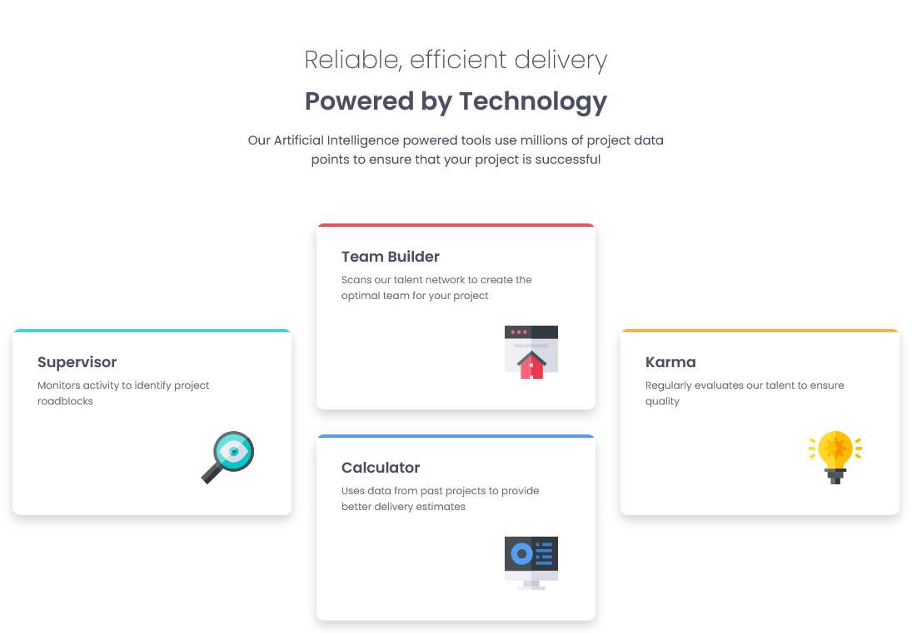

# Frontend Mentor - Four card feature section solution

This is a solution to the [Four card feature section challenge on Frontend Mentor](https://www.frontendmentor.io/challenges/four-card-feature-section-weK1eFYK).

## Overview

### Screenshot

### Links

- Live Site URL: [Click Me!](https://abdullah-tuncer.github.io/fm-four-card-feature-section/)

## My process

### Built with

- Semantic HTML5 markup
- CSS custom properties
- Flexbox
- Mobile-first workflow

## Author

- LinkedIn - [Abdullah Tunçer](https://www.linkedin.com/in/abdullah-tuncer/)
- Frontend Mentor - [@abdullah-tuncer](https://www.frontendmentor.io/profile/abdullah-tuncer)