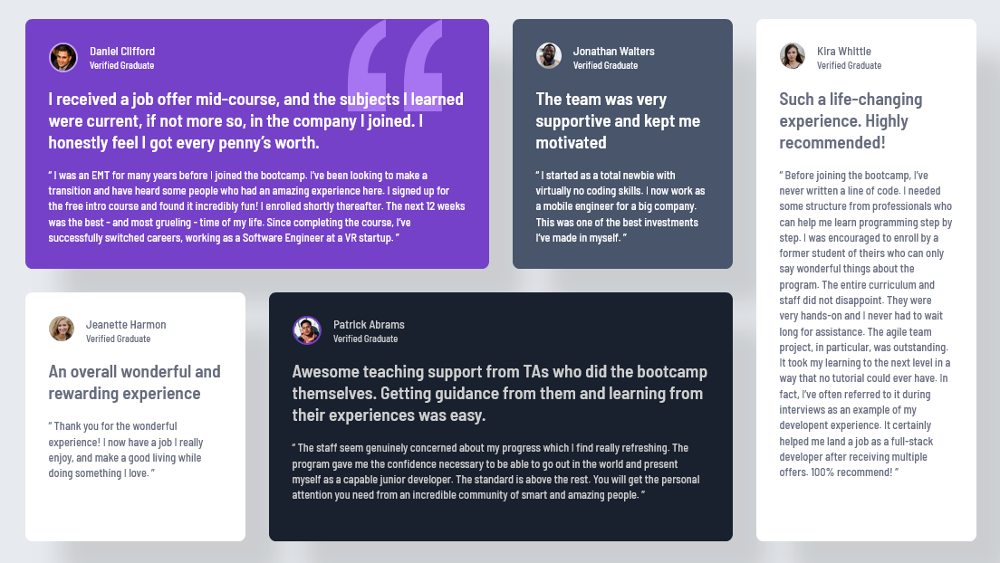

# Frontend Mentor - Testimonials grid section solution

This is a solution to the [Testimonials grid section challenge on Frontend Mentor](https://www.frontendmentor.io/challenges/testimonials-grid-section-Nnw6J7Un7). 

## Overview

### Screenshot

### Links

- Live Site URL: [Click Me!](https://abdullah-tuncer.github.io/Frontend-Mentor/07-testimonials-grid-section-main/)
- Other Solutions: [Click Me!](https://abdullah-tuncer.github.io/Frontend-Mentor/)

## My process

### Built with

- Semantic HTML5 markup
- CSS custom properties
- CSS Grid
- Flexbox
- Mobile-first workflow

## Author

- LinkedIn - [Abdullah Tunçer](https://www.linkedin.com/in/abdullah-tuncer/)
- Frontend Mentor - [@abdullah-tuncer](https://www.frontendmentor.io/profile/abdullah-tuncer)
